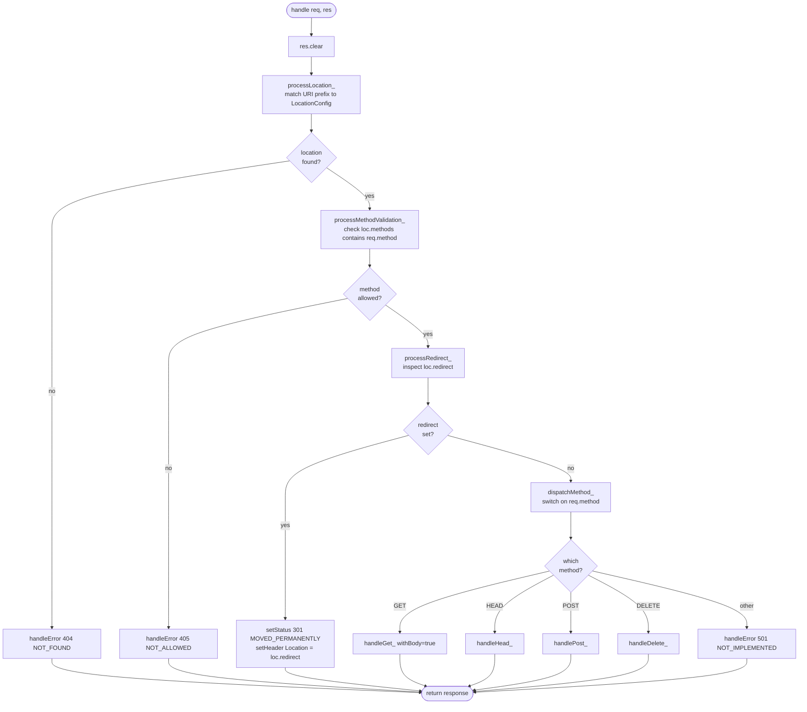
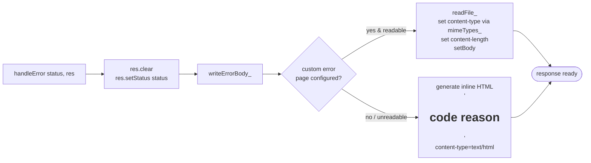

# Response Build Flow — `RequestHandler`

This diagram traces what happens inside [RequestHandler::handle()](../src/Http/RequestHandler.cpp#L27)
from the moment a parsed `HttpRequest` arrives until an `HttpResponse` is fully populated.

## High-level flow

## Step-by-step

| # | Step | Source | What it does |
|---|------|--------|--------------|
| 1 | clear | [RequestHandler.cpp:29](../src/Http/RequestHandler.cpp#L29) | Reset any previous state on the response object. |
| 2 | match location | [processLocation_](../src/Http/RequestHandler.cpp#L45) → [matchLocation_](../src/Http/RequestHandler.cpp#L98) | Longest-prefix match of `req.uri()` against `config_.locations`. `404` if none match. |
| 3 | validate method | [processMethodValidation_](../src/Http/RequestHandler.cpp#L59) → [isMethodAllowed_](../src/Http/RequestHandler.cpp#L119) | Reject with `405` if `req.method()` isn't in `loc.methods`. |
| 4 | redirect | [processRedirect_](../src/Http/RequestHandler.cpp#L68) | If `loc.redirect` is non-empty, emit `301` + `Location` and stop. |
| 5 | dispatch | [dispatchMethod_](../src/Http/RequestHandler.cpp#L78) | Route to `handleGet_` / `handleHead_` / `handlePost_` / `handleDelete_`; unknown verbs get `501`. |

## Error path

Implemented in [handleError](../src/Http/RequestHandler.cpp#L191) and [writeErrorBody_](../src/Http/RequestHandler.cpp#L198).

## Filesystem helpers used by method handlers

- [readFile_](../src/Http/RequestHandler.cpp#L169) — slurps a file into a string for the body.
- [fileExists_](../src/Http/RequestHandler.cpp#L182) / [isDirectory_](../src/Http/RequestHandler.cpp#L160) — `stat`-based checks.
- [buildDirectoryListing_](../src/Http/RequestHandler.cpp#L131) — generates an HTML autoindex page.
- [mimeTypes_](../src/Http/RequestHandler.cpp#L224) — resolves `Content-Type` from the path's extension via `RequestHelpers::getContentType`.
